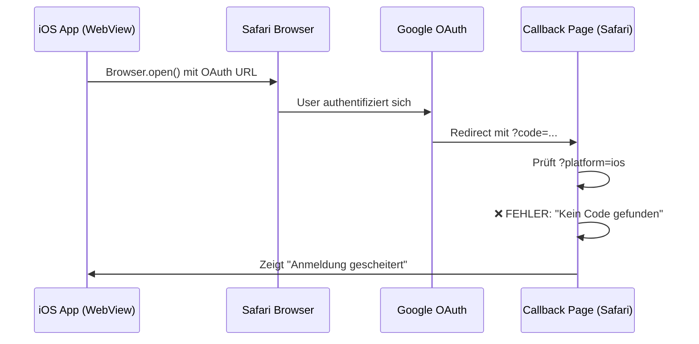
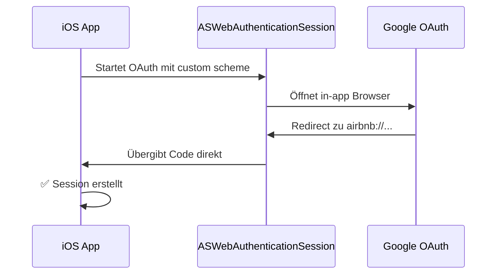

# iOS OAuth Login - Status & Problemübersicht

**Projekt:** HabDaWas iOS App (Native Wrapper für beta.habdawas.at)
**Aktuelle Version:** v1.0.20 (Web: v1.4.14)
**Letzte Aktualisierung:** 2025-10-13
**Status:** 🔴 OAuth Login funktioniert nicht auf iOS (Web funktioniert perfekt)

---

## 📱 Projektstruktur

```
/Users/martinmollay/Development/
├── bazar_bold/              # React Web App (Vite + React + TypeScript)
│   ├── src/
│   │   ├── contexts/AuthContext.tsx          # OAuth Implementierung
│   │   └── components/Auth/OAuthCallbackPage.tsx  # Callback Handler
│   └── dist/                # Build Output → wird zu iphone_app/www kopiert
│
└── iphone_app/              # iOS Native Wrapper (Capacitor 7.4.3)
    ├── ios/App/             # Xcode Projekt
    ├── www/                 # Kopie von bazar_bold/dist
    └── capacitor.config.json
```

### Tech Stack
- **Frontend:** React 18.3 + TypeScript + Material-UI + React Router
- **Backend:** Supabase (Auth, Database, Storage)
- **iOS Framework:** Capacitor 7.4.3
- **OAuth Provider:** Google OAuth 2.0
- **Custom URL Scheme:** `habdawas://`

---

## ✅ Was funktioniert PERFEKT

### Web App (beta.habdawas.at im Browser)
- ✅ Google OAuth Login funktioniert einwandfrei
- ✅ User wird zu Google weitergeleitet
- ✅ Nach erfolgreicher Authentifizierung zurück zur App
- ✅ Session wird korrekt erstellt
- ✅ User ist eingeloggt

**Beweis:** Die Supabase-Konfiguration und OAuth-Setup sind korrekt!

---

## 🔴 Was NICHT funktioniert

### iOS Native App
- ❌ OAuth Flow startet korrekt
- ❌ Safari öffnet sich mit Google OAuth
- ❌ User authentifiziert sich bei Google
- ❌ Google redirected zu `beta.habdawas.at/auth/callback?platform=ios&code=...`
- ❌ **HIER BRICHT ES AB:** Fehlermeldung "Anmeldung gescheitert"
- ❌ App erhält keine Session

---

## 🔍 Das Problem im Detail

### Aktueller OAuth Flow (iOS)



### Warum funktioniert es nicht?

**Hypothese 1:** Google schickt keinen `code` Parameter zurück
- Callback Page erwartet: `?platform=ios&code=ABC123&state=XYZ...`
- Callback Page erhält: `?platform=ios` (ohne code?)
- → Daher die Fehlermeldung "Kein Autorisierungscode gefunden"

**Hypothese 2:** Google schickt einen OAuth-Fehler
- Callback Page könnte: `?platform=ios&error=access_denied&error_description=...` erhalten
- → Neue Debug-Version (v1.0.20) sollte das zeigen

**Hypothese 3:** Deep Link funktioniert nicht richtig
- Selbst wenn code vorhanden ist, redirect zu `habdawas://auth/callback?...` öffnet nicht die App
- → App wird nicht getriggert vom Deep Link

---

## 🛠️ Bisherige Lösungsversuche

### Version 1.0.17 (v1.4.11)
❌ **GenericOAuth2 Plugin verwendet**
- Problem: Öffnet Chrome statt Safari (wenn Chrome default Browser)
- Chrome kann keine Deep Links zurück zur App handhaben

### Version 1.0.18 (v1.4.12)
✅ **GenericOAuth2 entfernt, Browser.open() direkt verwendet**
- Vorteil: Erzwingt Safari (SFSafariViewController)
- Problem: Endlos-Weiterleitung zu Google

### Version 1.0.19 (v1.4.13)
✅ **URL Parameter Strategy: ?platform=ios**
- Vorteil: Zuverlässige Platform-Detection (funktioniert auch in Safari)
- Problem: Weiterhin "Anmeldung gescheitert"

### Version 1.0.20 (v1.4.14) ⭐ AKTUELL
✅ **Enhanced Debugging**
- Alle URL Parameter werden geloggt
- OAuth-Fehler werden erkannt und angezeigt
- Debug Info Box auf Error Screen
- **Ziel:** Herausfinden, WAS Google tatsächlich zurückschickt

---

## 💡 Wie machen es andere Apps? (z.B. Airbnb)

### Airbnb's OAuth Flow (funktioniert perfekt!)



### Unterschiede zu unserem Ansatz:

| Aspekt | Unser Ansatz | Airbnb/Standard iOS |
|--------|-------------|---------------------|
| Browser | Browser.open() → Safari | ASWebAuthenticationSession (iOS native) |
| Redirect | Via JavaScript redirect | Direkt vom Browser-Context |
| URL Scheme | habdawas:// | airbnb:// |
| Zwischenschritt | OAuthCallbackPage (JavaScript) | Kein Zwischenschritt |
| Komplexität | Hoch (3 Schritte) | Niedrig (direkt) |

---

## 🎯 Mögliche Lösungen

### ✅ Option 1: ASWebAuthenticationSession verwenden (EMPFOHLEN!)
**Wie Airbnb und andere professionelle Apps**

**Vorteile:**
- Native iOS API speziell für OAuth entwickelt
- Kein JavaScript-Zwischenschritt nötig
- Direkte Übergabe des OAuth-Codes an die App
- Bewährt bei Millionen Apps (Airbnb, Spotify, etc.)
- Simpler, robuster, wartbarer

**Implementierung:**
1. Capacitor Plugin oder native iOS Code für ASWebAuthenticationSession
2. OAuth URL direkt an ASWebAuthenticationSession übergeben
3. Custom URL Scheme (`habdawas://`) wird automatisch erkannt
4. Code wird direkt an App übergeben
5. `exchangeCodeForSession()` im App-Kontext (nicht in Safari!)

**Beispiel Plugin:** `@capacitor-community/apple-sign-in` oder custom plugin

---

### ⚠️ Option 2: Aktuellen Ansatz debuggen (AKTUELL)
**Weitermachen mit Browser.open() + JavaScript Redirect**

**Nächste Schritte:**
1. Debug Info von v1.0.20 auswerten (Was schickt Google zurück?)
2. Deep Link Handler in iOS testen
3. Falls `code` vorhanden: Prüfen ob Deep Link funktioniert
4. Falls kein `code`: Google OAuth Konfiguration prüfen

**Problem:** Fundamentale Architektur - viele bewegliche Teile, anfällig

---

### ❌ Option 3: Universal Links statt Deep Links
**Komplexer Ansatz mit mehr Setup**

**Problem:** Erfordert:
- AASA (Apple App Site Association) File auf Server
- iOS Entitlements Konfiguration
- Domain Verification
- Funktioniert nur wenn App installiert ist

**Bewertung:** Zu komplex für das Problem

---

## 📊 Empfehlung

### 🏆 BESTE LÖSUNG: ASWebAuthenticationSession

**Warum:**
1. **Bewährt:** Millionen Apps nutzen es erfolgreich
2. **Einfach:** Weniger Code, weniger Fehlerquellen
3. **Nativ:** Nutzt iOS APIs wie vorgesehen
4. **Robust:** Keine JavaScript-Abhängigkeiten in Safari
5. **Zukunftssicher:** Apple-supported API

**Aufwand:**
- Einmaliges Setup eines Capacitor Plugins (oder native iOS Code)
- Umschreiben der OAuth-Logik in AuthContext.tsx
- Entfernen der OAuthCallbackPage Komplexität

**Zeitaufwand:** 2-3 Stunden vs. potentiell Tage weiteres Debugging

---

## 🔧 Technische Details

### Supabase OAuth Konfiguration

**Google OAuth Redirect URLs (in Google Cloud Console):**
```
https://hsbjflixgavjqxvnkivi.supabase.co/auth/v1/callback
https://beta.habdawas.at/auth/callback
```

### Capacitor Konfiguration

**capacitor.config.json:**
```json
{
  "appId": "at.habdawas.app",
  "server": {
    "iosScheme": "https",
    "allowNavigation": [
      "beta.habdawas.at",
      "*.habdawas.at",
      "*.supabase.co",
      "accounts.google.com"
    ]
  }
}
```

**Info.plist URL Scheme:**
```xml
<key>CFBundleURLTypes</key>
<array>
  <dict>
    <key>CFBundleURLSchemes</key>
    <array>
      <string>habdawas</string>
    </array>
  </dict>
</array>
```

### Deep Link Listener (AuthContext.tsx)

```typescript
App.addListener('appUrlOpen', async (event) => {
  if (event.url.includes('habdawas://auth/callback')) {
    const { error } = await supabase.auth.exchangeCodeForSession(event.url);
    // Dieser Code wird NIE erreicht aktuell!
  }
});
```

---

## 📝 Nächste Schritte

### Kurzfristig (Aktuellen Ansatz debuggen)
1. ✅ v1.0.20 deployed mit Debug Info
2. ⏳ OAuth Versuch durchführen
3. ⏳ Debug Info auslesen (Was schickt Google?)
4. ⏳ Basierend auf Debug Info nächsten Schritt entscheiden

### Mittelfristig (Wenn Debug zeigt fundamentales Problem)
1. ⏳ ASWebAuthenticationSession recherchieren
2. ⏳ Capacitor Plugin finden oder erstellen
3. ⏳ OAuth Flow umbauen auf native API
4. ⏳ Testen und verifizieren

---

## 📚 Referenzen

### Erfolgreiche OAuth Implementierungen
- **Airbnb iOS App:** Nutzt ASWebAuthenticationSession
- **Spotify iOS App:** Nutzt ASWebAuthenticationSession
- **GitHub iOS App:** Nutzt ASWebAuthenticationSession

### Apple Dokumentation
- [ASWebAuthenticationSession](https://developer.apple.com/documentation/authenticationservices/aswebauthenticationsession)
- [Authenticating a User Through a Web Service](https://developer.apple.com/documentation/authenticationservices/authenticating_a_user_through_a_web_service)

### Capacitor / Supabase
- [Supabase Auth with PKCE](https://supabase.com/docs/guides/auth/native-mobile-deep-linking)
- [Capacitor Deep Links](https://capacitorjs.com/docs/guides/deep-links)

---

## 🆘 Debugging Checklist

Wenn der aktuelle Ansatz weiter verfolgt wird:

- [ ] Debug Info von v1.0.20 auswerten
- [ ] Welche URL Parameter schickt Google zurück?
- [ ] Gibt es einen `code` Parameter?
- [ ] Gibt es einen `error` Parameter?
- [ ] Console Logs in Safari Remote Debugging prüfen
- [ ] Deep Link Handler mit Test-URL testen: `xcrun simctl openurl booted "habdawas://auth/callback?code=TEST123"`
- [ ] Google Cloud Console: Redirect URLs überprüfen
- [ ] Supabase Dashboard: OAuth Settings überprüfen

---

**Letzte Änderung:** 2025-10-13
**Version:** v1.0.20 / v1.4.14
